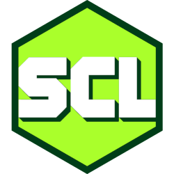

## My portfolio
### [open it here](https://www.sv443.me/)
<!--  -->

 

- **[Development](#development)**
- **[Featured projects](#featured-projects)**
  - [JokeAPI](#jokeapi)            REST API that serves jokes in various formats, such as JSON, XML, and YAML. It also provides a web interface for users to interact with the API.
  - [React, TS, MUI, Three.js, Electron Template](https://github.com/Sv443/React-Three-Electron-Template)       Template project for desktop- and webapp hybrid games, visualizations and simulations
  - [This portfolio](#portfolio)        My portfolio page inside this repository
  - [@pubcore/vite-storybook-mui](#pubcore-vite-storybook-mui)      Component library for React using Material UI with Storybook and Vite
  - [BetterYTM](#betterytm)       Userscript that improves YouTube Music with features such as improved lyrics lookup, fine volume control and lots more layout and usability improvements
  - [UserUtils](#userutils)    Zero-dependency library with tons of web utilities for userscripts
  - [geniURL](#geniurl)         Simple JSON and XML REST API to search for song metadata and lyrics
  - [BrewBot](#brewbot)      General-purpose Discord bot with a focus on moderation, utility and games
  - [Townly & Teng](#townly-teng)  Unfinished TS CLI city building game and an accompanying game engine
  - [SvCoreLib](#svcorelib)  Zero-dependency library with tons of miscellaneous quality of life features for backend Node.js projects

  

## Featured projects
<h3 id="jokeapi-documentation"> JokeAPI • <a href="https://github.com/Sv443-Network/JokeAPI-Docs" rel="noopener noreferer" target="_blank">https://github.com/Sv443-Network/JokeAPI-Docs</a></h3>
A REST API that serves jokes in various formats, such as JSON, XML, YAML and plain text. It also provides a crude web interface for users to test interacting with the API and to read the fucking manual.  
  
- JokeAPI is currently being remade for its upcoming major update, including a new frontend using Docusaurus, TypeScript and React, as well as a new TypeScript and Express backend

 

<h3 id="brewbot"> BrewBot • <a href="https://github.com/codedrunks/BrewBot" rel="noopener noreferer" target="_blank">https://github.com/codedrunks/BrewBot</a></h3>
A general-purpose Discord bot with a focus on utility and games.  
  
- It is written in TypeScript, uses Prisma as its ORM, PostgreSQL as its database and Redis for caching
- The bot has many API integrations including some of my own; [JokeAPI](#jokeapi) and [geniURL](#geniurl), as well as some third-party APIs like Wikipedia and Steam
- Contains minigames rendered on an HTML5 canvas and sent as an image attachment
- Has a fully fledged art (or anything else, really) contest system with participation, voting and winner selection
- Works with the latest Discord API standards (slash commands) and latest features (modal form, button component rows, etc.)

 

<h3 id="betterytm"> BetterYTM • <a href="https://github.com/Sv443/BetterYTM" rel="noopener noreferer" target="_blank">https://github.com/Sv443/BetterYTM</a></h3>
A userscript that improves YouTube Music with features such as improved lyrics lookup, fine volume control and tons more layout and usability improvements.  
(Userscripts are scripts that are injected into a website to modify its behavior in any way, kind of like a browser extension that can't modify anything related to the browser itself.)  
  
- BetterYTM has frontends made in pure HTML, CSS and JS, to stay in strict size limits and to not hog too many resources
- It is used by a couple hundred people weekly
- The userscript has an extensive plugin interface for other developers to add their own features
- I learned using every bundler under the sun for this project (webpack, turbopack, vite, babel) and ended up using rollup

 

<h3 id="userutils">UserUtils • <a href="https://github.com/Sv443-Network/UserUtils" rel="noopener noreferer" target="_blank">https://github.com/Sv443-Network/UserUtils</a></h3>
Zero-dependency library with various utilities for userscripts.  
Allows userscripts to easily register listeners for when CSS selectors exist, intercept events, manage persistent user configurations, modify the DOM more easily and much more.  
  
- Has tons of frequently used functions, all thoroughly typed and documented
- Supports ESM, CJS and global imports for bundled userscripts, as well as importing via the `@require` directive
- Bundled and compiled using tsup via GitHub actions and versioned with changesets
- Used in my userscripts [BetterYTM](#betterytm) and my [TS template for userscripts](https://github.com/Sv443/Userscript.ts)

 

<h3 id="portfolio"> This portfolio • <a href="https://sv443.github.io/" rel="noopener noreferer" target="_blank">https://sv443.github.io/</a></h3>
My portfolio page inside this repository.  
  
- It is built with TypeScript, React, MUI and PostCSS
- The project uses GitHub actions for CI/CD and is hosted on GitHub pages for free and easy deployment and good uptime
- The project is built using Vite and includes Storybook for component development
- I made it with a focus on responsiveness and accessibility

 

<h3 id="pubcore-vite-storybook-mui">@pubcore/vite-storybook-mui • <a href="https://github.com/pubcore/vite-storybook-mui" rel="noopener noreferer" target="_blank">https://github.com/pubcore/vite-storybook-mui</a></h3>
Component library for React using Material UI with Storybook and Vite.  
  
- Contains many versatile and reusable React components, fully typed with TypeScript
- Components include a highly flexible data table, XLSX and CSV mapping forms, forms built according to a JSON schema and more
- I was a contributor to the project, helped with the development of it and used it extensively in other projects

 

<h3 id="geniurl">geniURL • <a href="https://api.sv443.net/geniurl" rel="noopener noreferer" target="_blank">https://api.sv443.net/geniurl</a></h3>
A simple JSON and XML REST API to search for song metadata, the lyrics URL and lyrics translations using the genius.com API.  
Authorization is not required and geniURL implements a fuzzy search that improves search result accuracy.  
  
- My first exposure to express and express-router for setting up a robust HTTP server and Fuse.js for fuzzy searching
- Used a couple hundred times each day (mostly due to my userscript [BetterYTM](#betterytm))

 

<h3 id="townly-teng"> Townly & Teng • <a href="https://github.com/Sv443/Townly" rel="noopener noreferer" target="_blank">https://github.com/Sv443/Townly</a> & <a href="https://github.com/Sv443/Teng" rel="noopener noreferer" target="_blank">https://github.com/Sv443/Teng</a></h3>
Townly was meant to be a CLI city building game and Teng is the CLI game engine that was powering it.  
The projects were my first exposure to TypeScript and the first time I used it in a real project and it taught me a lot.  
  
- I got really far feature-wise but lost interest in the project and it was eventually put on hold
- The engine was designed to be modular, separated from the game Townly, and easy to use, but it was never used in another project
- The game has had a history of rewrites, from JS to Qt C++ to TypeScript

 

<h3 id="svcorelib"> SvCoreLib • <a href="https://github.com/Sv443-Network/SvCoreLib" rel="noopener noreferer" target="_blank">https://github.com/Sv443-Network/SvCoreLib</a></h3>
A core library used oftentimes in my projects, containing tons of miscellaneous quality of life features.  
It is written in JavaScript but has a TypeScript declaration file and JSDoc comments for an equivalent TypeScript experience.  
  
- My first experience making a decent JS library
- Received contributions from other developers
- Only ever supported CommonJS, though a refactor is in the works to support ESM

  

## Development
To set up the project locally, follow the steps below:
1. Install Node.js
2. Fork (if contributing) and clone the repository
3. Install the dependencies with the command `npm i`
4. Copy the file `.env.template` to `.env` and fill in the environment variables
  
- Run the development server with the command `npm run dev`
- Run `npm run build` to build the project for production
- Run `npm run storybook` to start the Storybook server, which is used to develop and test the components in isolation
- To add shadcn components to the project, use `npx shadcn-ui@latest add name`
